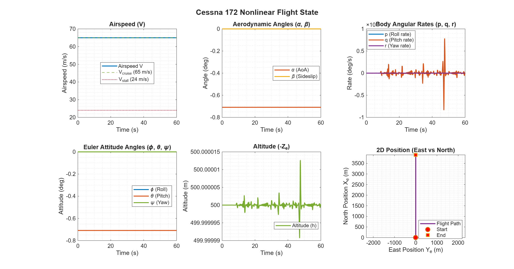
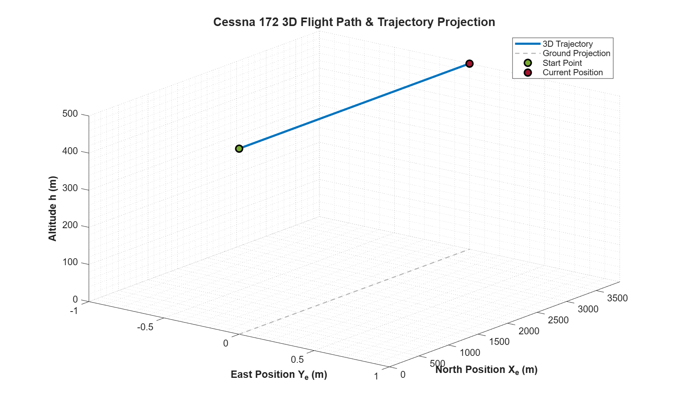
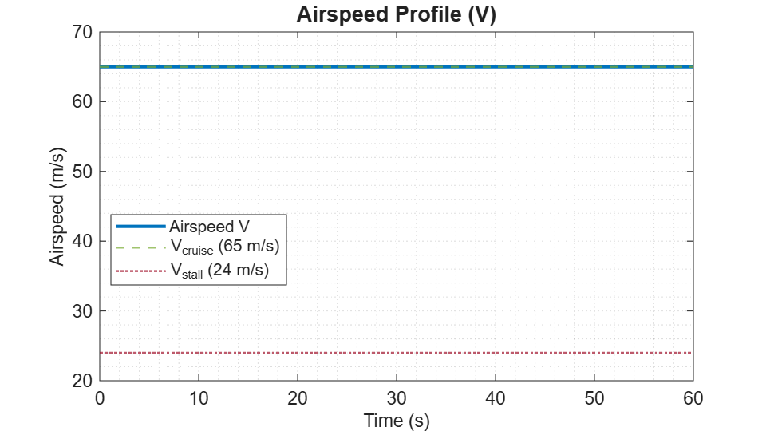
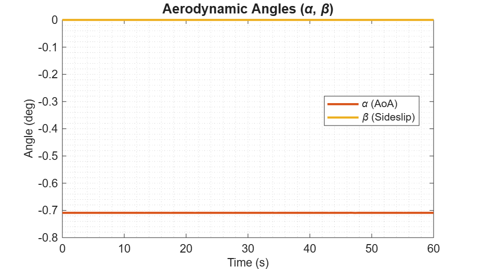
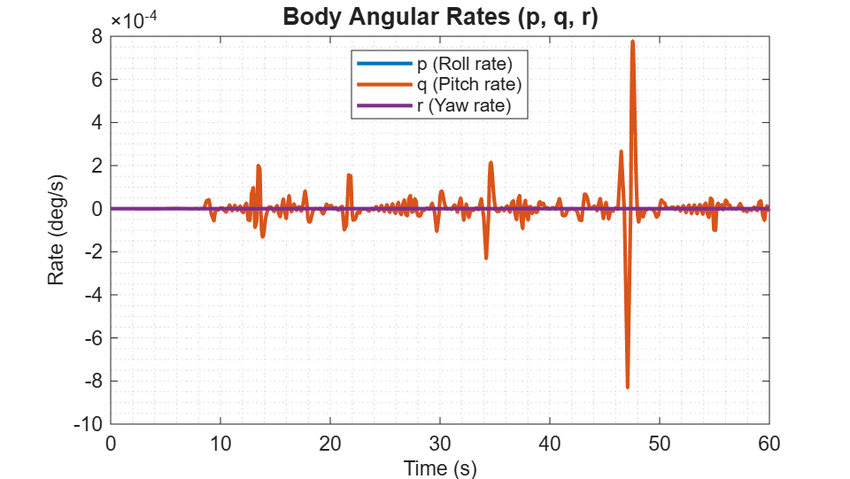
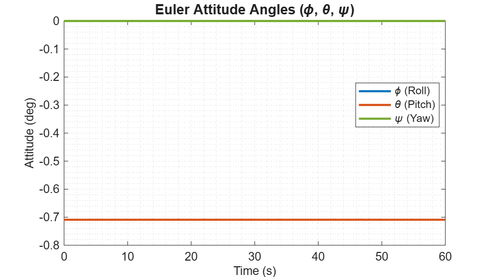
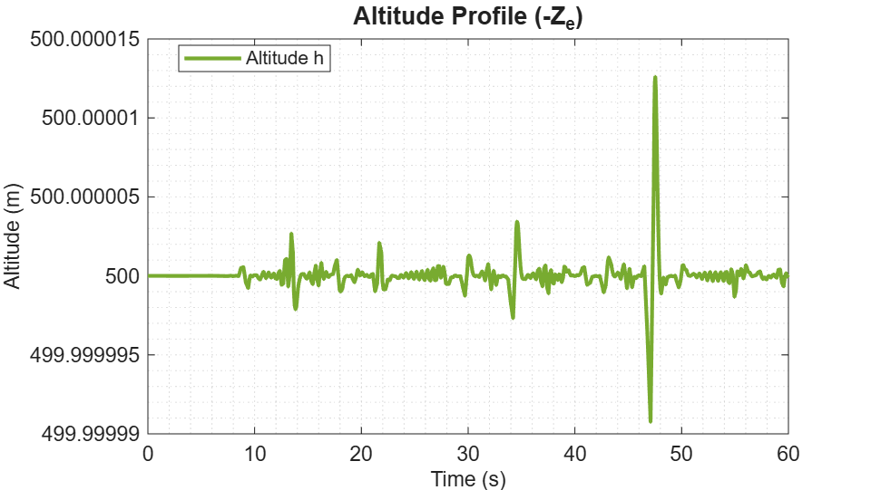
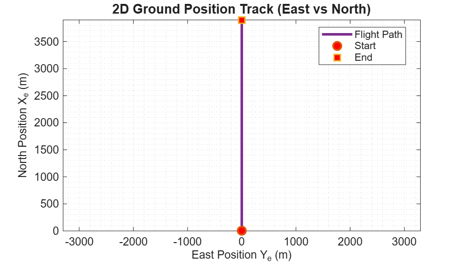

# ✈️ Cessna 172 Nonlinear 6-DOF Flight Dynamics, Trim & Simulation

An advanced MATLAB platform for full 6-Degree-of-Freedom (6-DOF) nonlinear flight dynamics modeling, numerical trim equilibrium optimization using `fsolve`, stability mode linearization analysis, and 3D flight trajectory visualization.

---

## 📌 Executive Summary & Architecture

This repository models the complete nonlinear equations of motion (EOM) for a **Cessna 172 Skyhawk** fixed-wing aircraft.

The project is structured into two main development phases:
- **Phase 1 (Current Baseline)**: Nonlinear 6-DOF EOM formulation, full 12-state numerical trimming ([`trim.m`](file:///D:/MATLAB/MY-PROJECTS/FixedWing/sixDofNonlinear/src/matlabFiles/trim.m)), `ode45` numerical trajectory simulation ([`RunSimulation.m`](file:///D:/MATLAB/MY-PROJECTS/FixedWing/sixDofNonlinear/src/matlabFiles/RunSimulation.m)), publication-quality plotting ([`dataplot.m`](file:///D:/MATLAB/MY-PROJECTS/FixedWing/sixDofNonlinear/src/matlabFiles/dataplot.m)), and automatic plot exporting to `results/`.
- **Phase 2 (Upcoming Development)**: Linearization state-space matrix extraction ($A, B, C, D$) and Flight Control System (FCS) design (Pitch/Roll Autopilots, Altitude/Airspeed Hold, PID/LQR control).

---

## ⚙️ Mathematical & Physics Foundation

The model implements the 12 nonlinear ordinary differential equations (ODEs) governing aircraft motion in body and Earth-fixed (NED) frames:

$$\dot{x} = [\dot{V}, \dot{\alpha}, \dot{\beta}, \dot{p}, \dot{q}, \dot{r}, \dot{\phi}, \dot{\theta}, \dot{\psi}, \dot{x}_e, \dot{y}_e, \dot{z}_e]^T$$

### Forces & Moments Balance
1. **Aerodynamic Forces & Moments**: Evaluated using non-dimensional stability and control derivatives ($C_{L}, C_{D}, C_{Y}, C_{l}, C_{m}, C_{n}$).
2. **Propulsion Model**: Maximum thrust $T_{\text{max}} = 2500\text{ N}$ scaled linearly by throttle $\delta_t \in [0, 1]$.
3. **Gravity Forces**: Transformed to body axes via Euler pitch ($\theta$) and roll ($\phi$) angles.

---

## 🚀 How to Run the Code (User Guide)

To execute the complete simulation and visualization pipeline, follow these 3 sequential steps in MATLAB:


### **Step 1: Calculate Trim Condition (`trim.m`)**
Run [`src/matlabFiles/trim.m`](file:///D:/MATLAB/MY-PROJECTS/FixedWing/sixDofNonlinear/src/matlabFiles/trim.m) in the MATLAB Command Window:
```matlab
trim
```
- **Target Condition**: Airspeed $V = 65\text{ m/s}$, Altitude $h = 500\text{ m}$ ($z_e = -500\text{ m}$).
- **Solver**: MATLAB `fsolve` optimizes 11 free parameters ($z = [\alpha, \beta, p, q, r, \phi, \theta, \delta_e, \delta_a, \delta_r, \delta_t]$) until all dynamic state rates evaluate to zero ($< 10^{-10}$).
- **Stability Analysis**: Automatically linearizes the system matrix $A$ and checks all 12 eigenvalues ($\lambda_i$) to confirm Small-Disturbance Dynamic Stability (Short-Period, Phugoid, Dutch Roll, Roll Damping, Spiral modes).
- **Output**: Saves `trim_results.mat` containing `x_trim` and `U_trim`.

### **Step 2: Execute Simulation (`RunSimulation.m`)**
Run [`src/matlabFiles/RunSimulation.m`](file:///D:/MATLAB/MY-PROJECTS/FixedWing/sixDofNonlinear/src/matlabFiles/RunSimulation.m) in MATLAB:
```matlab
RunSimulation
```
- Integrates the 6-DOF nonlinear differential equations using `ode45` over $t \in [0, 60]\text{ s}$ starting from trimmed initial conditions `x_trim` and control inputs `U_trim`.

### **Step 3: Generate & Save Visualizations (`dataplot.m`)**
Run [`src/matlabFiles/dataplot.m`](file:///D:/MATLAB/MY-PROJECTS/FixedWing/sixDofNonlinear/src/matlabFiles/dataplot.m) in MATLAB:
```matlab
dataplot
```
- Automatically renders combined **Figure 1** (6-panel state profile) and **Figure 2** (3D flight path trajectory) on screen (`drawnow`).
- **Interactive Options**:
  - Prompt 1: Generates **6 separate individual figure windows** for each state profile upon request (`y/n`).
  - Prompt 2: Exports and saves all generated figures into the [`results/`](file:///D:/MATLAB/MY-PROJECTS/FixedWing/sixDofNonlinear/results) directory (`y/n`).

---

## 📊 Results & Visualizations

Simulation output images stored in [`results/`](file:///D:/MATLAB/MY-PROJECTS/FixedWing/sixDofNonlinear/results):

### 1. Combined 6-State Flight Profile


### 2. 3D Flight Trajectory Projection


### 3. Individual State Breakdown Plots
| Airspeed Profile ($V$) | Aerodynamic Angles ($\alpha, \beta$) |
| :---: | :---: |
|  |  |

| Angular Rates ($p, q, r$) | Euler Attitude Angles ($\phi, \theta, \psi$) |
| :---: | :---: |
|  |  |

| Altitude Profile ($h$) | 2D Position Ground Track ($Y_e$ vs $X_e$) |
| :---: | :---: |
|  |  |

---

## 🗺️ Project Roadmap & Development Phases

```text
Phase 1: Open-Loop Dynamics & Trim (COMPLETED ✅)
├── [x] 12-ODE Nonlinear EOM Formulation (C172NonlinearModel.m)
├── [x] Full 12-State & 4-Control Trim Solver using fsolve (trim.m)
├── [x] Altitude (h = 500m) & Speed (V = 65m/s) Trim Condition
├── [x] Dynamic Mode Eigenvalue Stability Analysis
├── [x] ode45 Numerical Trajectory Simulation (RunSimulation.m)
└── [x] Interactive Multi-Figure Plotting & Exporter (dataplot.m)

Phase 2: Flight Control System Design (UPCOMING 🚀)
├── [ ] State-Space Linearization Extraction (A, B, C, D Matrix)
├── [ ] Transfer Function Derivation (Elevator-to-Pitch, Aileron-to-Roll)
├── [ ] Pitch & Roll Autopilot Design (PID Control)
├── [ ] Altitude Hold & Heading Hold Autopilot
└── [ ] LQR / Robust Flight Control & Disturbances Testing
```

---

## 📁 Repository Structure

```text
sixDofNonlinear/
│
├── README.md                           # Main Project Documentation
├── LICENSE                             # License file
│
├── results/                            # Exported High-Res Simulation Plots
│   ├── Flight_State_Combined.png       # Combined 6-panel state profile
│   ├── 3D_Trajectory.png               # 3D trajectory isometric view
│   ├── Airspeed_V.png                  # Separate Airspeed plot
│   ├── Aerodynamic_Angles.png          # Separate AoA & Sideslip plot
│   ├── Angular_Rates.png               # Separate Roll, Pitch, Yaw rates plot
│   ├── Euler_Attitude_Angles.png       # Separate Roll, Pitch, Yaw angles plot
│   ├── Altitude_Profile.png            # Separate Altitude profile plot
│   └── Ground_Track_2D.png             # Separate 2D ground position track plot
│
└── src/
    └── matlabFiles/
        ├── C172NonlinearModel.m        # 6-DOF 12-ODE Nonlinear Aircraft EOM
        ├── trim.m                      # Full 12-State fsolve Trim Solver & Stability Analysis
        ├── RunSimulation.m             # ode45 Simulation Integration Script
        ├── dataplot.m                  # Interactive Plotter & Figure Exporter
        ├── initializeParameters_C172.m # Loader for parameters and mat files
        ├── aircraft_parameters.m       # Mass, inertia, and geometric data script
        ├── stabilityNcontrolDerivatives.m # Stability & control derivatives script
        ├── aircraft_parameters.mat     # Saved aircraft parameters MAT file
        └── Stability&ControlDerivative.mat # Saved stability derivatives MAT file
```
