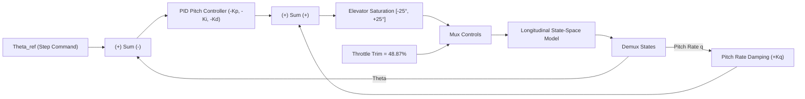

# ✈️ Cessna 172 Nonlinear 6-DOF Dynamics, Linearization & Flight Control System (FCS)

An advanced MATLAB & Simulink platform for full 6-Degree-of-Freedom (6-DOF) nonlinear flight dynamics modeling, numerical trim equilibrium optimization using `fsolve`, dynamic stability linearization, and step-by-step modular Flight Control System (FCS) design in Simulink (`controller.slx`).

---

## 📌 Executive Summary & Architecture

This repository models the complete nonlinear equations of motion (EOM) and state-space linearized dynamics for a **Cessna 172 Skyhawk** fixed-wing aircraft.

The project is structured into modular development phases for step-by-step versioning:
- **Baseline Dynamics & Trim (Completed ✅)**: Nonlinear 12-ODE formulation ([`C172NonlinearModel.m`](file:///D:/MATLAB/MY-PROJECTS/FixedWing/sixDofNonlinear/src/C172NonlinearModel.m)), 12-state `fsolve` trim solver ([`trimAndStability.m`](file:///D:/MATLAB/MY-PROJECTS/FixedWing/sixDofNonlinear/src/trimAndStability.m)), trajectory simulation ([`RunSimulation.m`](file:///D:/MATLAB/MY-PROJECTS/FixedWing/sixDofNonlinear/src/RunSimulation.m)), and automated state-space linearization ([`liniarizeModel.m`](file:///D:/MATLAB/MY-PROJECTS/FixedWing/sixDofNonlinear/src/liniarizeModel.m)).
- **FCS Phase 1 (Completed ✅)**: Cascaded Pitch Control Loop ($\theta$ attitude tracking PID + $K_q$ pitch rate damping) in Simulink ([`src/controller.slx`](file:///D:/MATLAB/MY-PROJECTS/FixedWing/sixDofNonlinear/src/controller.slx)).
- **FCS Phase 2 (Upcoming 🚀)**: Roll Control Loop ($\phi$ attitude hold via aileron $\delta_a$).
- **FCS Phase 3 (Upcoming 🚀)**: Yaw Damper & Turn Coordination ($\beta$ sideslip control via rudder $\delta_r$).
- **FCS Phase 4 (Upcoming 🚀)**: Altitude Hold ($h$) & Airspeed Hold ($V$) Autopilot loops.
- **FCS Phase 5 (Upcoming 🚀)**: Full 6-DOF Nonlinear Aircraft Dynamics & Guidance Integration.

---

## ⚙️ Mathematical & Control Foundation

### 1. 12-State Nonlinear Model
$$\dot{x} = [\dot{V}, \dot{\alpha}, \dot{\beta}, \dot{p}, \dot{q}, \dot{r}, \dot{\phi}, \dot{\theta}, \dot{\psi}, \dot{x}_e, \dot{y}_e, \dot{z}_e]^T$$

### 2. Linearized Longitudinal Subsystem (`sys_lon`)
State vector: $x_{\text{lon}} = [V, \alpha, q, \theta, h]^T$, Input vector: $u_{\text{lon}} = [\delta_e, \delta_t]^T$.

### 3. Phase 1 Pitch Control System Architecture


#### Pitch Control Law:
$$\delta_e(t) = \delta_{e,\text{trim}} - \left( K_p e_\theta + K_i \int_0^t e_\theta dt + K_d \dot{e}_\theta \right) + K_q q(t)$$

- **Tuned Control Gains**: $K_p = 1.0$, $K_i = 0.2$, $K_d = 0.02$, $K_q = 0.45$.
- **Trim Conditions**: Airspeed $V = 65\text{ m/s}$, Altitude $h = 500\text{ m}$, Throttle $\delta_{t,\text{trim}} = 48.87\%$, Elevator $\delta_{e,\text{trim}} = -0.18^\circ$.

---

## 🚀 How to Run the Code (User Guide)


### **Step 1: Trim Calculation (`trimAndStability.m`)**
```matlab
run('src/trimAndStability.m');
```
Solves full 12-state equilibrium at $V = 65\text{ m/s}, h = 500\text{ m}$ using `fsolve` and evaluates open-loop dynamic stability eigenvalues.

### **Step 2: State-Space Linearization (`liniarizeModel.m`)**
```matlab
run('src/liniarizeModel.m');
```
Extracts linearized system matrices $A, B, C, D$ via numerical differentiation and splits into decoupled `sys_lon` and `sys_lat` models.

### **Step 3: Execute Simulink Controller (`controller.slx`)**
Open and run [`src/controller.slx`](file:///D:/MATLAB/MY-PROJECTS/FixedWing/sixDofNonlinear/src/controller.slx) in Simulink:
```matlab
open_system('src/controller.slx');
sim('controller.slx');
```
Automated callbacks (`InitFcn`) load `trim_results.mat`, `linearized_model.mat`, and `pitch_gains.mat`.

---

## 📊 Results & Visualizations

### 1. Phase 1: Pitch Control Loop Step Response ($5^\circ$ Step Command)


#### Performance Metrics:
- **Target Pitch Command ($\theta_{\text{ref}}$)**: $5.00^\circ$ ($0.0873\text{ rad}$)
- **Rise Time ($t_r$, 10%–90%)**: $1.340\text{ s}$
- **Percentage Overshoot (%OS)**: $7.56\%$
- **Maximum Elevator Deflection**: $12.84^\circ$ (Smooth response, zero saturation)

---

## 🗺️ Project Roadmap & Version-Wise Development

```text
Baseline Open-Loop Dynamics & Linearization (COMPLETED ✅)
├── [x] 12-ODE Nonlinear EOM Formulation (C172NonlinearModel.m)
├── [x] Full 12-State & 4-Control Trim Solver using fsolve (trimAndStability.m)
├── [x] State-Space Linearization & Subsystem Decoupling (liniarizeModel.m)
└── [x] Dynamic Mode Eigenvalue Stability Analysis

Flight Control System (FCS) Development in Simulink (IN PROGRESS 🚀)
├── [x] Phase 1: Pitch Control Loop (controller.slx)
│       ├── Pitch Angle Tracking PID Controller (Kp=1.0, Ki=0.2, Kd=0.02)
│       ├── Pitch Rate Damping (Kq=0.45) for Short-Period Damping
│       ├── Elevator Saturation Limits (±25 deg)
│       └── Trim Throttle Setting Initialization (48.87%)
├── [ ] Phase 2: Roll Control Loop (Aileron-to-Roll Angle Autopilot)
├── [ ] Phase 3: Yaw Damper & Turn Coordination (Rudder-to-Sideslip Autopilot)
├── [ ] Phase 4: Altitude Hold & Airspeed Hold Autopilots
└── [ ] Phase 5: Full 6-DOF Nonlinear Dynamics & Guidance Integration
```

---

## 📁 Repository Structure

```text
sixDofNonlinear/
│
├── README.md                           # Main Project Documentation
├── LICENSE                             # License file
│
├── results/                            # Simulation Output Plots
│   ├── Pitch_Loop_Response.png         # Phase 1 Pitch Control Step Response Plot
│   ├── Flight_State_Combined.png       # 6-panel open-loop state profile
│   └── 3D_Trajectory.png               # 3D trajectory isometric view
│
└── src/
    ├── controller.slx                  # Main Simulink Flight Control System Model
    ├── C172NonlinearModel.m            # 6-DOF 12-ODE Nonlinear Aircraft EOM
    ├── trimAndStability.m              # Full 12-State fsolve Trim Solver
    ├── liniarizeModel.m                # State-Space Linearization & Decoupling
    ├── RunSimulation.m                 # ode45 Simulation Integration Script
    ├── dataplot.m                      # Multi-Figure Plotter & Exporter
    ├── aircraft_parameters.m           # Mass, inertia, and geometric data script
    └── stabilityNcontrolDerivatives.m  # Aerodynamic stability derivatives script
```
