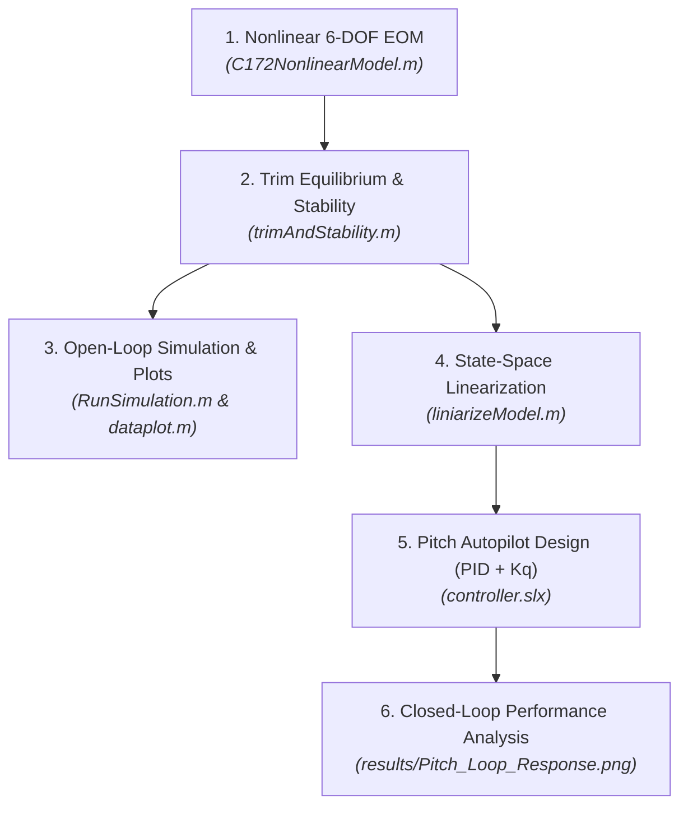
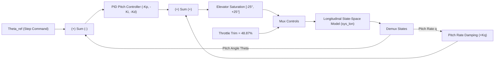
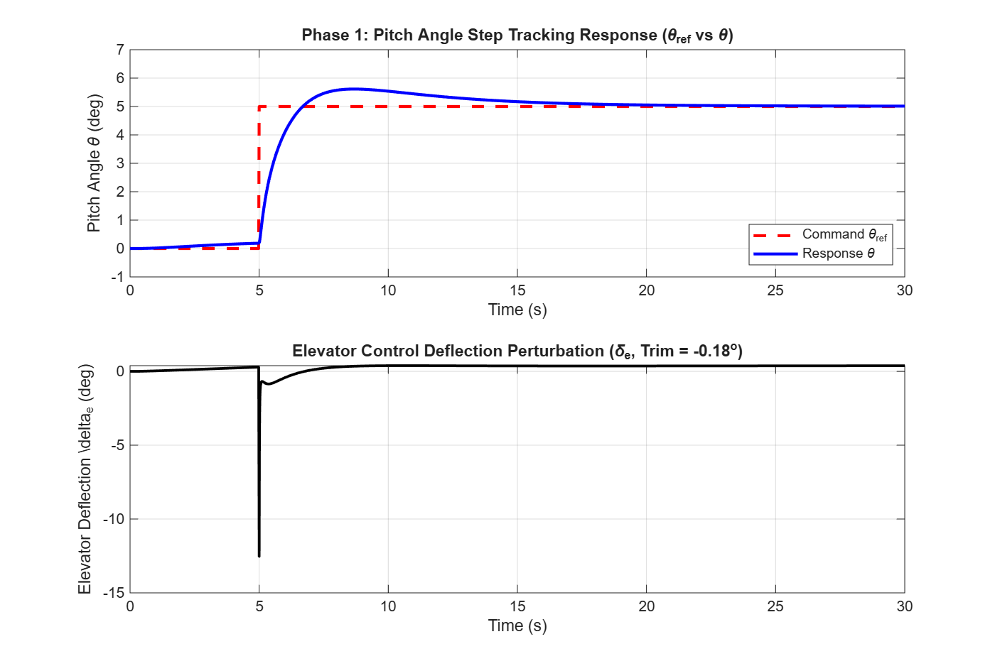

# ✈️ Cessna 172 Nonlinear 6-DOF Dynamics, Trim, Linearization & Flight Control System (FCS)

An advanced, end-to-end MATLAB & Simulink framework for full 6-Degree-of-Freedom (6-DOF) nonlinear flight dynamics modeling, numerical trim equilibrium optimization using `fsolve`, small-disturbance dynamic stability analysis, state-space model linearization, and step-by-step Flight Control System (FCS) design in Simulink (`controller.slx`).

---

## 📌 Executive Summary & Architecture Overview

This project provides a complete flight dynamics and control platform for a **Cessna 172 Skyhawk** fixed-wing aircraft. The codebase transitions seamlessly from raw nonlinear physics equations to a fully closed-loop controlled autopilot system.



---

## ⚙️ Mathematical & Engineering Methodology

### Phase 1: 12-State Nonlinear Equations of Motion (`C172NonlinearModel.m`)

The 6-DOF aircraft motion is governed by 12 coupled nonlinear Ordinary Differential Equations (ODEs) evaluated in Body and Earth-fixed (NED) coordinate frames:

$$\dot{x} = [\dot{V}, \dot{\alpha}, \dot{\beta}, \dot{p}, \dot{q}, \dot{r}, \dot{\phi}, \dot{\theta}, \dot{\psi}, \dot{x}_e, \dot{y}_e, \dot{z}_e]^T$$

#### 1. State & Control Vectors:
- **State Vector ($x \in \mathbb{R}^{12}$)**:
  - Velocity & Aerodynamic Angles: Airspeed $V$, Angle of Attack $\alpha$, Sideslip Angle $\beta$
  - Body Angular Rates: Roll rate $p$, Pitch rate $q$, Yaw rate $r$
  - Euler Attitude Angles: Roll angle $\phi$, Pitch angle $\theta$, Yaw angle $\psi$
  - Inertial Position (NED): North $x_e$, East $y_e$, Altitude $h = -z_e$
- **Control Vector ($u \in \mathbb{R}^{4}$)**:
  - Elevator deflection $\delta_e$, Aileron deflection $\delta_a$, Rudder deflection $\delta_r$, Throttle setting $\delta_t \in [0, 1]$.

#### 2. Forces & Moments Formulation:
- **Aerodynamic Forces & Moments**: Calculated using non-dimensional stability and control derivatives ($C_L, C_D, C_Y, C_l, C_m, C_n$).
- **Propulsive Force**: Maximum thrust $T_{\text{max}} = 2500\text{ N}$ scaled linearly by throttle setting $\delta_t$.
- **Gravitational Force**: Transformed to body axes using Euler pitch ($\theta$) and roll ($\phi$) angles.

---

### Phase 2: Trim Equilibrium Solver & Dynamic Stability (`trimAndStability.m`)

To establish steady straight-and-level flight, numerical optimization is performed to find the equilibrium point where all dynamic state derivatives vanish ($\dot{x} \approx 0$).

- **Target Flight Condition**: Airspeed $V = 65\text{ m/s}$, Altitude $h = 500\text{ m}$ ($z_e = -500\text{ m}$).
- **Optimization Engine**: MATLAB `fsolve` solves for 11 free parameters:
  $$z = [\alpha, \beta, p, q, r, \phi, \theta, \delta_e, \delta_a, \delta_r, \delta_t]^T$$
- **Trim Results Obtained**:
  - Angle of Attack ($\alpha_{\text{trim}}$): $1.15^\circ$ ($0.0200\text{ rad}$)
  - Pitch Angle ($\theta_{\text{trim}}$): $1.15^\circ$ ($0.0200\text{ rad}$)
  - Elevator Deflection ($\delta_{e,\text{trim}}$): $-0.18^\circ$ ($-0.0031\text{ rad}$)
  - Throttle Setting ($\delta_{t,\text{trim}}$): $48.87\%$ ($0.4887$)
  - All lateral/directional states ($\beta, p, q, r, \phi, \delta_a, \delta_r$) evaluate to $0.0$.
- **Small-Disturbance Dynamic Stability Analysis**:
  Evaluates the eigenvalues ($\lambda_i$) of the numerical Jacobian matrix $A = \frac{\partial f}{\partial x}$ at trim to verify open-loop modal stability (Short-Period, Phugoid, Dutch Roll, Roll Damping, Spiral).

---

### Phase 3: Open-Loop Simulation & Plotting (`RunSimulation.m` & `dataplot.m`)

Starting from the trimmed equilibrium state $x_{\text{trim}}$ and constant control inputs $U_{\text{trim}}$, the full 12-state nonlinear model is integrated over $t \in [0, 60]\text{ s}$ using `ode45`.

[`dataplot.m`](file:///D:/MATLAB/MY-PROJECTS/FixedWing/sixDofNonlinear/src/dataplot.m) provides automated multi-figure rendering, displaying:
1. **6-Panel Combined Flight Profile**: Time series of $V, \alpha/\beta, p/q/r, \phi/\theta/\psi, h,$ and $Y_e$ vs $X_e$.
2. **3D Flight Path Trajectory**: 3D spatial curve ($X_e, Y_e, Z_e$) in NED coordinates.
3. **Interactive Figure Exporter**: Saves high-resolution PNG plots into the [`results/`](file:///D:/MATLAB/MY-PROJECTS/FixedWing/sixDofNonlinear/results) directory.

---

### Phase 4: State-Space Linearization & Subsystem Decoupling (`liniarizeModel.m`)

The 12-state nonlinear system is linearized around the trim point using central-difference numerical perturbation:

$$\Delta \dot{x} = A \Delta x + B \Delta u$$

The full 12-state model is decoupled into standard small-disturbance sub-models:

#### 1. Longitudinal Subsystem (`sys_lon`):
- **State Vector**: $x_{\text{lon}} = [V, \alpha, q, \theta, h]^T$
- **Control Vector**: $u_{\text{lon}} = [\delta_e, \delta_t]^T$

#### 2. Lateral-Directional Subsystem (`sys_lat`):
- **State Vector**: $x_{\text{lat}} = [\beta, p, r, \phi, \psi]^T$
- **Control Vector**: $u_{\text{lat}} = [\delta_a, \delta_r]^T$

---

### Phase 5: Flight Control System (FCS) - Cascaded Pitch PID Autopilot (`controller.slx`)

To achieve precise pitch attitude command tracking ($\theta_{\text{ref}}$) and suppress pitch oscillation, a **Cascaded Pitch Control Architecture** is designed in Simulink (`src/controller.slx`).



#### Pitch Control Law:
$$\delta_e(t) = \delta_{e,\text{trim}} - \left( K_p e_\theta(t) + K_i \int_0^t e_\theta(\tau) d\tau + K_d \frac{d e_\theta(t)}{dt} \right) + K_q q(t)$$

- **Outer Loop (Pitch Attitude PID)**: Tracks reference pitch angle $\theta_{\text{ref}}$ with error $e_\theta = \theta_{\text{ref}} - \theta$.
- **Inner Loop (Pitch Rate Damping $K_q$)**: Adds rate feedback from pitch rate $q$ to enhance short-period damping.
- **Tuned Controller Parameters**:
  - $K_p = 1.0$, $K_i = 0.2$, $K_d = 0.02$, $K_q = 0.45$
  - Elevator Deflection Limits: $\delta_e \in [-25^\circ, +25^\circ]$
  - Throttle Setting: Fixed at trim value $\delta_{t,\text{trim}} = 48.87\%$

---

## 🚀 How to Run the Project (Step-by-Step User Guide)

Follow these steps in MATLAB to execute the complete pipeline from trim calculation to controller simulation:


### **Step 1: Compute Trim Equilibrium & Modal Stability**
Run [`src/trimAndStability.m`](file:///D:/MATLAB/MY-PROJECTS/FixedWing/sixDofNonlinear/src/trimAndStability.m) in MATLAB:
```matlab
run('src/trimAndStability.m');
```
*Solves 12-state trim at $V = 65\text{ m/s}, h = 500\text{ m}$ using `fsolve` and exports `trim_results.mat`.*

### **Step 2: Run Open-Loop Trajectory Simulation & Generate Plots**
Run [`src/RunSimulation.m`](file:///D:/MATLAB/MY-PROJECTS/FixedWing/sixDofNonlinear/src/RunSimulation.m) followed by [`src/dataplot.m`](file:///D:/MATLAB/MY-PROJECTS/FixedWing/sixDofNonlinear/src/dataplot.m):
```matlab
run('src/RunSimulation.m');
run('src/dataplot.m');
```
*Integrates open-loop ODEs with `ode45` and exports high-resolution open-loop plot figures to `results/`.*

### **Step 3: Linearize System Dynamics**
Run [`src/liniarizeModel.m`](file:///D:/MATLAB/MY-PROJECTS/FixedWing/sixDofNonlinear/src/liniarizeModel.m):
```matlab
run('src/liniarizeModel.m');
```
*Builds full state-space matrices ($A, B, C, D$), extracts decoupled `sys_lon` and `sys_lat`, and exports `linearized_model.mat`.*

### **Step 4: Execute Simulink Pitch Autopilot (`controller.slx`)**
Open and simulate the Simulink control model:
```matlab
open_system('src/controller.slx');
sim('src/controller.slx');
```
*Simulates the closed-loop pitch response to a $5^\circ$ step pitch command.*

---

## 📊 Complete Results & Visualizations Gallery

All output plots generated by the pipeline are exported to [`results/`](file:///D:/MATLAB/MY-PROJECTS/FixedWing/sixDofNonlinear/results):

### 1. Closed-Loop Pitch Control System Response (`controller.slx`)


| Performance Parameter | Target Value / Metric | Obtained Value |
| :--- | :--- | :--- |
| **Pitch Step Command ($\theta_{\text{ref}}$)** | $5.00^\circ$ ($0.0873\text{ rad}$) | $5.00^\circ$ (Zero steady-state error) |
| **10%–90% Rise Time ($t_r$)** | $< 2.0\text{ s}$ | **$1.340\text{ s}$** |
| **Percentage Overshoot (%OS)** | $< 10.0\%$ | **$7.56\%$** |
| **Max Elevator Deflection** | Within $[-25^\circ, +25^\circ]$ | **$12.84^\circ$** (Smooth, non-saturating) |

---

### 2. Open-Loop Nonlinear Dynamic Flight Trajectories

| 6-State Combined Flight Profile | 3D Flight Trajectory Projection |
| :---: | :---: |
|  |  |

---

### 3. Individual State Profile Breakdown

| Airspeed Profile ($V$) | Aerodynamic Angles ($\alpha, \beta$) |
| :---: | :---: |
|  |  |

| Angular Rates ($p, q, r$) | Euler Attitude Angles ($\phi, \theta, \psi$) |
| :---: | :---: |
|  |  |

| Altitude Profile ($h$) | 2D Ground Track ($Y_e$ vs $X_e$) |
| :---: | :---: |
|  |  |

---

## 🗺️ Project Roadmap & Versioning Matrix

```text
Phase 1: Baseline 6-DOF Dynamics & Trim (COMPLETED ✅)
├── [x] 12-ODE Nonlinear Equations of Motion (C172NonlinearModel.m)
├── [x] Mass, Inertia & Aerodynamic Derivatives loader (aircraft_parameters.m)
├── [x] 12-State & 4-Control fsolve Equilibrium Trim Solver (trimAndStability.m)
├── [x] Open-Loop Dynamic Stability Eigenvalue Analysis
├── [x] ode45 Numerical Trajectory Integrator (RunSimulation.m)
└── [x] Multi-Figure Visualization & Image Exporter (dataplot.m)

Phase 2: Linearization & FCS Pitch Autopilot (COMPLETED ✅)
├── [x] Numerical Central-Difference Jacobian Extraction (liniarizeModel.m)
├── [x] Longitudinal & Lateral-Directional State-Space Decoupling (sys_lon, sys_lat)
├── [x] Simulink Flight Control System Model Construction (controller.slx)
├── [x] Cascaded Pitch Angle PID Tracking Controller (Kp=1.0, Ki=0.2, Kd=0.02)
├── [x] Pitch Rate Inner-Loop Damping (Kq=0.45)
└── [x] Pitch Step Response Performance Verification (results/Pitch_Loop_Response.png)

Phase 3: Multi-Axis FCS & Autopilot Expansion (UPCOMING 🚀)
├── [ ] Roll Angle Hold Autopilot (Aileron-to-Roll Angle PID)
├── [ ] Yaw Damper & Turn Coordinator (Rudder-to-Sideslip Control)
├── [ ] Altitude Hold Autopilot (Cascaded Pitch-to-Altitude Control)
├── [ ] Airspeed Hold Autopilot (Auto-Throttle Controller)
└── [ ] Full 6-DOF Closed-Loop Guidance & Trajectory Tracking
```

---

## 📁 Complete Repository Structure

```text
sixDofNonlinear/
│
├── README.md                           # Master Project Documentation & User Manual
├── LICENSE                             # Project License
│
├── results/                            # Exported High-Resolution Figures
│   ├── Pitch_Loop_Response.png         # Closed-loop pitch step response plot
│   ├── Flight_State_Combined.png       # 6-panel open-loop state summary plot
│   ├── 3D_Trajectory.png               # 3D spatial trajectory isometric view
│   ├── Airspeed_V.png                  # Open-loop airspeed profile plot
│   ├── Aerodynamic_Angles.png          # Open-loop AoA & Sideslip angle plot
│   ├── Angular_Rates.png               # Open-loop Roll, Pitch, Yaw rate plot
│   ├── Euler_Attitude_Angles.png       # Open-loop Euler angles plot
│   ├── Altitude_Profile.png            # Open-loop altitude profile plot
│   └── Ground_Track_2D.png             # Open-loop 2D ground track plot
│
└── src/
    ├── C172NonlinearModel.m            # 6-DOF 12-ODE Nonlinear Aircraft EOM
    ├── trimAndStability.m              # Full 12-State fsolve Trim & Modal Stability Solver
    ├── RunSimulation.m                 # ode45 Open-Loop Simulation Integrator
    ├── dataplot.m                      # Multi-Figure Interactive Plotter & PNG Exporter
    ├── liniarizeModel.m                # Central-Difference Linearization & Subsystem Split
    ├── controller.slx                  # Simulink Flight Control System (FCS) Model
    ├── initializeParameters_C172.m     # Parameter and derivative loading utility script
    ├── aircraft_parameters.m           # Geometric, mass, and moment of inertia data
    ├── stabilityNcontrolDerivatives.m # Non-dimensional aerodynamic stability derivatives
    ├── aircraft_parameters.mat         # Saved aircraft physical parameters MAT file
    ├── Stability&ControlDerivative.mat # Saved aerodynamic derivatives MAT file
    ├── trim_results.mat                # Trim state x_trim & control U_trim data file
    ├── linearized_model.mat            # Full and decoupled state-space matrices MAT file
    └── pitch_gains.mat                 # Tuned pitch PID and Kq gains MAT file
```
